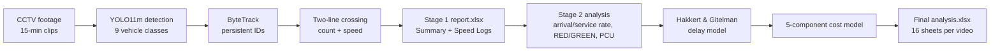

# Assessment and Mitigation of Average Delay and its Economic Cost in Dhaka Level Crossings

**A Machine Learning–Driven and Econometric Analysis of Railway Level-Crossing Congestion**


> **Thesis:** *Assessment and Mitigation of Average Delay and its Economic Cost Modeling in Level Crossings of Dhaka Using Machine Learning-Driven Models and Econometric Analysis.*

This repository contains the full computer-vision and traffic-engineering pipeline used to quantify the **average vehicular delay** and the resulting **economic cost** caused by railway gate closures at two level-crossing intersections in Dhaka, Bangladesh — **Khilgaon** (heavily congested) and **Mohakhali** (lighter traffic).

CCTV footage is processed with a custom-trained YOLO11 detector and a two-line vehicle-counting method to recover traffic flow, signal timing and per-vehicle speed. These are then fed into a Hakkert & Gitelman delay model and a five-component cost model (travel-time, fuel, electricity, pollution and vehicle operating cost) to estimate the monetary burden of congestion.

---

## Key Findings

Estimated **annual economic cost of gate-closure congestion per monitored approach** (model output, aggregated over 240 working days + 125 weekend days):

| Intersection | Annual Cost (BDT) | Dominant Component |
|---|---|---|
| **Khilgaon** | ≈ 60.5 million | Vehicle Operating Cost |
| **Mohakhali** | ≈ 19.6 million | Vehicle Operating Cost |

> Khilgaon's congestion-induced loss is roughly **3.9× higher** than Mohakhali's, driven by near-continuous slow-moving traffic and a much higher rickshaw share.

*Figures are model estimates for the monitored camera direction; whole-intersection values are extrapolated using a directional distribution factor (D ≈ 0.55).*

---

## Repository Structure

| File | Stage | Purpose |
|---|---|---|
| `Dataset_stratification_and_merge.ipynb` | Data | Merges the Khilgaon + Mohakhali Roboflow datasets into one stratified dataset (geography, split, class and rare-class preserved) and verifies the 70/20/10 ratio per class. |
| `Dataset_Training.ipynb` | Training | Trains the YOLO11m vehicle detector on the merged Dhaka dataset (9 classes, multi-GPU). |
| `Polygon_Point_selector.ipynb` | Setup | Interactive OpenCV tool to click on the first video frame and export the pixel coordinates of the arrival/service counting lines. |
| `Khilgaon_vehicle_detection_count.ipynb` | Detection + Analysis | Full batch pipeline for the Khilgaon site (detection, tracking, counting, speed, delay, cost). |
| `Mohakhali_vehicle_detection_count.ipynb` | Detection + Analysis | Same pipeline configured for the Mohakhali site. |

Supporting artefacts (methodology write-up and per-site traffic/cost summary spreadsheets) accompany the notebooks for reference.

---

## Pipeline Overview



Each 15-minute clip runs through two stages:

1. **Stage 1 — Detection & Tracking.** YOLO11m detects vehicles frame-by-frame; ByteTrack assigns persistent IDs; vehicles are counted and timed using a **two-line crossing method**, producing an intermediate report with a *Summary*, *Speed Log–Arrival* and *Speed Log–Service* sheet.
2. **Stage 2 — Traffic Analysis.** The report is read back to compute arrival/service rates, gate RED/GREEN timing, PCU, delay, queue metrics and the full cost breakdown, written into a final `<video>_analysis.xlsx` workbook (the intermediate report is deleted after merging).

---

## The Detection Model

A custom-trained **YOLO11m (Ultralytics)** model trained on local Dhaka traffic imagery.

- **mAP@50 ≈ 0.75**
- **Inference:** confidence ≥ 0.10, IoU 0.45 (NMS), image size 1280×1280, FP16
- **Reference point:** bottom-centre of each bounding box, used for all line-crossing and speed checks

**Vehicle classes (9):**

| ID | Class | ID | Class | ID | Class |
|---|---|---|---|---|---|
| 0 | Rickshaw (battery) | 3 | Bus | 6 | Truck |
| 1 | Car | 4 | CNG (three-wheeler) | 7 | Van |
| 2 | Bike (motorcycle) | 5 | Bicycle | 8 | Leguna (tempo) |

### Counting & Speed (two-line method)

Two virtual lines are drawn across the road. A vehicle is counted **only when it crosses both lines in sequence**, and its speed is derived from the time between the two crossings:

```
Speed (km/h) = (d / Δt) × 3.6        Δt = (Exit Frame − Enter Frame) / FPS
```

where `d` is the physically measured real-world distance between the two lines and `FPS = 25`. Two line pairs are used: an **Arrival pair** (upstream, for arrival rate and RED/GREEN detection) and a **Service pair** (at the stop line, for service rate, speed and all cost analysis).

---

## Cost Model

Delay is estimated with the **Hakkert & Gitelman** level-crossing model, and translated into five cost components (all in BDT, calibrated to 2025–26 prices):

| Component | What it captures |
|---|---|
| **Travel-Time Cost** | Value of time lost by vehicles below the congested-speed threshold |
| **Fuel-Loss Cost** | Fuel burned while idling during gate closures |
| **Electricity Cost** | Idling energy of battery-powered rickshaws |
| **Pollution Cost** | Social cost of 8 pollutants (CO₂, CO, NOₓ, CH₄, SO₂, PM, HC, NMVOC) |
| **Vehicle Operating Cost** | Per-km operating cost over the delay period (FY 2025–26, IRI 14) |

Whole-intersection values are obtained by scaling count-based quantities by `1/D`, with the directional factor `D = 0.55` (range 0.50–0.60 used for sensitivity analysis).

---

## Site-Specific Configuration

The two notebooks differ only in hard-coded, physically measured values:

| Parameter | Khilgaon | Mohakhali |
|---|---|---|
| Arrival distance (m) | 1.676 | 1.42 |
| Service distance (m) | 1.676 | 0.94 |
| RED bin period (s) | 10 | 15 |
| Congested-speed threshold (km/h) | 4.5 | 5.0 |
| Road length (m) | 30.0 | 25.07 |
| Road entrance width (m) | 9.14 | 6.14 |
| RED detection source | Speed Log–Arrival | Speed Log–Service |
| Line coordinates (px) | site-specific | site-specific |

Shared constants (FPS = 25, fuel/electricity prices, YOLO thresholds, directional factor, etc.) are identical across both sites.

---

## Datasets

All data is hosted on Kaggle. The training set is the merged, labelled dataset; the per-site datasets contain the raw 15-minute CCTV clips used for detection and analysis. Click a dataset name to open it on Kaggle.

| Dataset | Site / Role |
|---|---|
| [Dhaka CC Dataset](https://www.kaggle.com/datasets/towfiqurrashid/dhaka-cc-dataset) | **Training** — merged & labelled, 9 classes (used by `Dataset_Training.ipynb`) |
| [Khilgaon 14-12](https://www.kaggle.com/datasets/towfiqurrashid/khilgaon-14-12) | Khilgaon CCTV footage *(also hosts the trained `best.pt` weights)* |
| [Khilgaon 17-12](https://www.kaggle.com/datasets/fatematuljannatoni/khilgaon-17-12) | Khilgaon CCTV footage |
| [Khilgaon 19-12](https://www.kaggle.com/datasets/towfiqovi/khilgaon-19-12) | Khilgaon CCTV footage |
| [Mohakhali 14-12](https://www.kaggle.com/datasets/towfiqurrashid/mohakhali-23-12-with-dates) | Mohakhali CCTV footage |
| [Mohakhali 17-12](https://www.kaggle.com/datasets/towfiqurrashid/mohakhali) | Mohakhali CCTV footage |
| [Mohakhali 19-12](https://www.kaggle.com/datasets/towfiqurrashid/mohakhali-25-12) | Mohakhali CCTV footage |

> The trained detector checkpoint (`best_map50_0.75.pt`) is bundled inside the **Khilgaon 14-12** dataset. Point `MODEL_PATH` in the detection notebooks at it, or train your own with `Dataset_Training.ipynb`.

---

## Getting Started

### 1. Install dependencies

```bash
# GPU (CUDA 12.8)
pip install torch torchvision torchaudio --index-url https://download.pytorch.org/whl/cu128

# Core libraries
pip install ultralytics supervision opencv-python ipywidgets matplotlib Pillow numpy openpyxl
```

> A CPU-only PyTorch index is also available in the first cells of the detection notebooks if no GPU is present.

### 2. (Optional) Reproduce the dataset & model
1. Run `Dataset_stratification_and_merge.ipynb` to merge the source Roboflow datasets into a single stratified dataset (you will need a Roboflow API key). The merged result is published as the [Dhaka CC Dataset](https://www.kaggle.com/datasets/towfiqurrashid/dhaka-cc-dataset).
2. Run `Dataset_Training.ipynb` on that dataset to train YOLO11m and produce a `best.pt` checkpoint.

### 3. Define counting lines
Open `Polygon_Point_selector.ipynb`, point `VIDEO_PATH` at the first frame of your footage, and click to place each line. Copy the printed coordinates into the detection notebook.

### 4. Run the analysis
1. Open `Khilgaon_vehicle_detection_count.ipynb` (or the Mohakhali equivalent).
2. Set `MODEL_PATH` to your trained checkpoint and list your 15-minute clips in `VIDEO_PATHS`.
3. Run all cells. The batch driver processes every video and produces one `<video>_analysis.xlsx` per clip.

---

## Output Structure

Each video yields one workbook containing the Stage-1 detection sheets (*Summary*, *Speed Log–Arrival*, *Speed Log–Service*) plus the Stage-2 analysis sheets: *Traffic Parameters*, *Delay Estimation*, *Travel Time Cost*, *Fuel Cost*, *Electricity Cost*, *Pollution Cost*, *VOC*, *Cost Summary*, *Reference Factors*, *Intersection Estimate*, and three *Queue* sheets.

---

## Data & Reproducibility Notes

- Footage was collected at the Khilgaon and Mohakhali level crossings on **14, 17 and 19 December 2025** across morning, afternoon and evening sessions.
- Counting-line coordinates, real-world distances and road dimensions are camera-specific and **must be re-measured** for any new footage.
- All prices and value-of-time figures are calibrated to Bangladesh 2025–26 conditions; update the constants in the configuration cells for other contexts.
- Raw CCTV footage, the merged training dataset and the trained model weights are all published on Kaggle — see the [Datasets](#datasets) section above. They are linked rather than committed here due to size.

---

## Methodology Reference

A detailed description of every detection, counting, speed, delay and cost calculation — including all hard-coded constants and the full Excel output schema — is provided in the accompanying methodology document.

## Citation

If you use this work, please cite the thesis:

```bibtex
@thesis{level_crossing_dhaka,
  title  = {Assessment and Mitigation of Average Delay and its Economic Cost
            Modeling in Level Crossings of Dhaka Using Machine Learning-Driven
            Models and Econometric Analysis},
  author = {Towfiqur Rashid},
  school = {Rajshahi University of Engineering and Technology},
  year   = {2026}
}
```

## License

This project is licensed under the **GNU Affero General Public License v3.0 (AGPL-3.0)** — see the [`LICENSE`](LICENSE) file for the full text.

In short, AGPL-3.0 requires that anyone who runs a modified version of this code (including over a network) makes their source available under the same terms. This choice is intentional and aligns with the [Ultralytics YOLO11](https://github.com/ultralytics/ultralytics) dependency, which is also AGPL-3.0, so the combined work stays license-compatible.

## Acknowledgements

Built with [Ultralytics YOLO11](https://github.com/ultralytics/ultralytics) and [Supervision (ByteTrack)](https://github.com/roboflow/supervision). Delay estimation follows the Hakkert & Gitelman level-crossing delay model.
